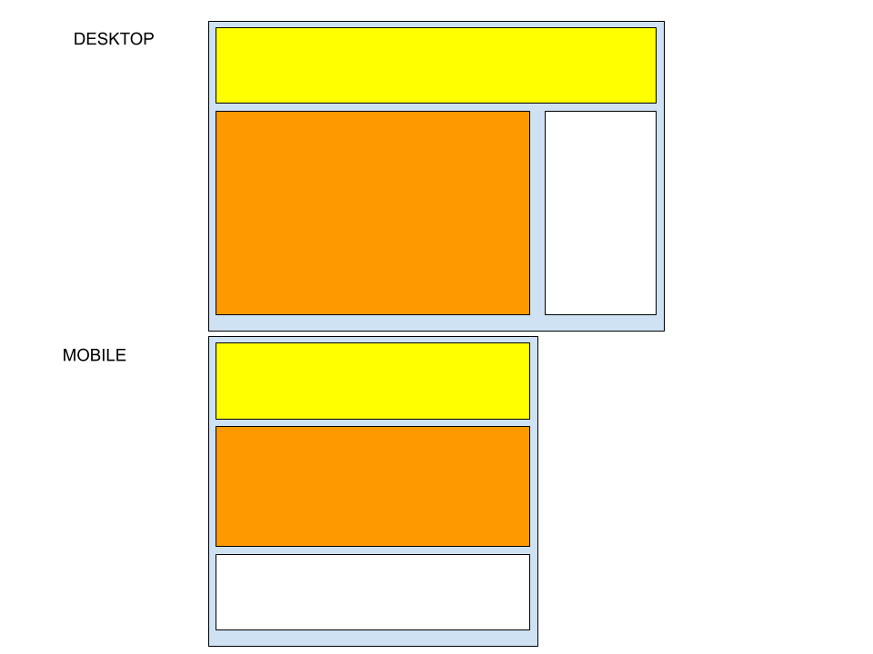

# CSS: Fundamentos

## Introducción a CSS

* [Reset CSS de Eric Meyer](https://meyerweb.com/eric/tools/css/reset/)
* [BEM](https://getbem.com/)

## Selectores

* [nth-child](https://developer.mozilla.org/en-US/docs/Web/CSS/:nth-child)
* [last-child](https://developer.mozilla.org/en-US/docs/Web/CSS/:last-child)
* [has](https://developer.mozilla.org/en-US/docs/Web/CSS/:has)
* [first-of-type](https://developer.mozilla.org/en-US/docs/Web/CSS/:first-of-type)
* [not](https://developer.mozilla.org/en-US/docs/Web/CSS/:not)
* [required](https://developer.mozilla.org/en-US/docs/Web/CSS/:required)
* [valid](https://developer.mozilla.org/en-US/docs/Web/CSS/:valid)

## Colores y tipografías

* [Background image](https://developer.mozilla.org/en-US/docs/Web/CSS/background-image)

## [El modelo de la caja](https://developer.mozilla.org/en-US/docs/Learn_web_development/Core/Styling_basics/Box_model)

## Disposición en pantalla

* Inline
* Block
* Relative
* Absolute
* Sticky
* Flex
  * [Flexbox Froggy](https://flexboxfroggy.com/#es)
* Grid
  * [Grid Garden](https://cssgridgarden.com/#es)

## [Diseño Responsive](https://developer.mozilla.org/en-US/docs/Web/CSS/CSS_media_queries/Using_media_queries)

**Lecturas recomendadas:**

* [Progressive Enhancement](https://developer.mozilla.org/en-US/docs/Glossary/Progressive_Enhancement)
* [Graceful Degradation](https://developer.mozilla.org/en-US/docs/Glossary/Graceful_degradation)
* [Progressive Enhancement vs Graceful Degradation](https://www.browserstack.com/guide/difference-between-progressive-enhancement-and-graceful-degradation#:~:text=Progressive%20enhancement%20is%20usually%20the,but%20builds%20towards%20it%20gradually.)

* [Link Element](https://developer.mozilla.org/en-US/docs/Web/HTML/Element/link)
* [calc()](https://developer.mozilla.org/en-US/docs/Web/CSS/calc)
* [Responsive Images](https://developer.mozilla.org/en-US/docs/Web/HTML/Responsive_images)

## CSS Animado

* [Transiciones](https://developer.mozilla.org/en-US/docs/Web/CSS/transition)
* [Transformaciones](https://developer.mozilla.org/en-US/docs/Web/CSS/transform)
* [Animaciones](https://developer.mozilla.org/en-US/docs/Web/CSS/animation)
* [Animate CSS](https://animate.style/)

## Variables CSS

* [Variables CSS](https://developer.mozilla.org/en-US/docs/Web/CSS/var)

## Preprocesadores

* [SASS](https://sass-lang.com/) (SCSS)

## Frameworks CSS

* [Tailwind](https://tailwindcss.com/)
* [Bootstrap](https://getbootstrap.com/docs/3.4/css/)
