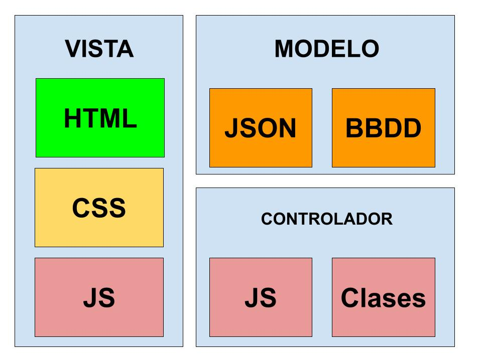

# JavaScript Avanzado

## Dev Tools de Google chrome

* [El panel de código fuente](https://developer.chrome.com/docs/devtools/sources)

## Herramientas de Linteo y Automatización

Necesitarás tener instalados los plugins de VS Code que tienes en el [README.md](../README.md#programas-necesarios) del proyecto.

Adicionalmente usaremos estas librerías más adelante, cuando hayamos [instalado NodeJS](6%20-%20NodeJS.md):

* [ESLint](https://eslint.org/) ```npm init @eslint/config@latest```
* [StyleLint](https://stylelint.io/) ```npm init stylelint```
* [Commitlint](https://commitlint.js.org/) ```npm install --save-dev @commitlint/{cli,config-conventional}```

## [Submódulos de Git](https://git-scm.com/book/en/v2/Git-Tools-Submodules)

Primero entras en la carpeta de tu proyecto principal desde el terminal, donde quieres que se clone el submódulo, y a continuación:

```bash
git submodule add [--name <submodule-name>] <repository> [<submodule-path>]
```

Luego hay que asegurarse de que se creó correctamente el archivo ```/.gitmodules```, de otro modo hay que crearlo a mano. Asegúrate de que haya un espacio en blanco entre los símbolos ```=``` y el texto por delante y por detrás de éstos:

```yaml
[submodule "submodule-name"]
path = submodule-path
url = https://github.com/user/repository.git
```

Para eliminar un submódulo usa:

```bash
git submodule deinit -f submodule-path
rm -rf .git/modules/submodule-name
git rm -f submodule-path
```

Cuando clones un proyecto con submódulos, has de usar la opción:

```bash
git clone --recurse-submodules https://github.com/user/repository.git
```

Si los submódulos no se están descargando al hacer checkout del proyecto, tendrás que lanzar un fetch recursivo:

```bash
git submodule update --init --recursive
```

Otras opciones también son (según la versión de Git):

```bash
git submodule update --recursive --remote
git submodule update --recursive
git pull --recurse-submodules
```

Recuerda que cada submódulo tiene sus propios git hooks, así que no le afectan los del repositorio donde se encuentra y tendrás que configurar su propio _lintstaged_ si quieres integrar herramientas de este tipo dentro de los submódulos.

Es muy probable que necesites habilitar las opciones de ejecución recursiva en tus comandos, revisa la documentación de tu _CI_ específico para más información.

Para más información, mejor [leer la referencia](https://git-scm.com/docs/gitmodules).

## [Principios de programación SOLID](https://en.wikipedia.org/wiki/SOLID)

* **Single responsibility principle:** cada clase debería tener una única responsabilidad
* **Open-closed principle:** las entidades deberían ser abiertas a la hora de poder extenderlas, pero cerradas a la hora de modificarlas
* **Liskov substitution principle:** el uso de métodos o referencias de una clase base no de cambiar al ser usadas desde una clase derivada
* **Interface segregation principle:** eliminación de dependencias innecesarias
* **Dependency inversion principle:** los estados dependen de abstracciones, no de concreciones

## Programación orientada a objetos

* [Clases](https://developer.mozilla.org/en-US/docs/Glossary/Class)
* Prototipos
* Herencia
* [Mixin](https://developer.mozilla.org/en-US/docs/Glossary/Mixin)
* [Call](https://developer.mozilla.org/en-US/docs/Web/JavaScript/Reference/Global_Objects/Function/call), [Apply](https://developer.mozilla.org/en-US/docs/Web/JavaScript/Reference/Global_Objects/Function/apply), [Bind](https://developer.mozilla.org/en-US/docs/Web/JavaScript/Reference/Global_Objects/Function/bind), [Assign](https://developer.mozilla.org/en-US/docs/Web/JavaScript/Reference/Global_Objects/Object/assign)

## [Patrones de diseño en JS](https://refactoring.guru/design-patterns)

* Creacional: esta categoría se centra en los mecanismos de creación de objetos que optimizan y controlan la creación de objetos. Ejemplos: Factory, Builder, Singleton, Abstract y Prototype
* Estructural: esta categoría se centra en las relaciones entre objetos. Garantizan que si una parte de un sistema cambia, no es necesario que todo el sistema cambie junto con ella. Ejemplos: Adapter, Decorator, Composite y Bridge
* Conductual: esta categoría reconoce, implementa y mejora la comunicación entre objetos dispares en un sistema. Garantiza que las partes dispares de un sistema tengan información sincronizada. Ejemplos: Command, Momento y Observer

Lecturas recomendadas:

* [Patrones de arquitectura y diseño en JavaScript](https://medium.com/@hjkmines/javascript-design-and-architectural-patterns-cfa900c6fe41)
* [Decoradores en JavaScript](https://www.sitepoint.com/javascript-decorators-what-they-are/)

## Modelo Vista Controlador



Patrones de arquitectura

* [Model-View-Controller](https://en.wikipedia.org/wiki/Model%E2%80%93view%E2%80%93controller) (MVC)
* [Model-View-Presenter](https://en.wikipedia.org/wiki/Model%E2%80%93view%E2%80%93presenter) (MVP)
* [Model-View-ViewModel](https://en.wikipedia.org/wiki/Model%E2%80%93view%E2%80%93viewmodel) (MVVM)
* [Hexagonal](https://en.wikipedia.org/wiki/Hexagonal_Architecture), también conocida por _Ports And Adapters_
* [Microservices](https://en.wikipedia.org/wiki/Microservices)
* [Monolithic](https://en.wikipedia.org/wiki/Monolithic_application)

Lectura recomendada: [Arquitectura orientada al dominio](https://dev.to/itswillt/a-different-approach-to-frontend-architecture-38d4)

## Inyección de dependencias

* [Gestión de Paquetes y librerías](https://developer.mozilla.org/en-US/docs/Learn_web_development/Extensions/Client-side_tools/Package_management)

### [Módulos](https://developer.mozilla.org/en-US/docs/Web/JavaScript/Guide/Modules)

[Importación de archivos estáticos](https://developer.mozilla.org/en-US/docs/Web/JavaScript/Reference/Statements/import/with):

```js
import data from 'https://example.com/data.json' with { type: 'json' };
import styles from 'https://example.com/styles.css' with { type: 'css' };
```

[Importación dinámica de módulos](https://developer.mozilla.org/en-US/docs/Web/JavaScript/Guide/Modules#dynamic_module_loading)

Importar un módulo sólo para obtener sus _side effects_:

```js
(async () => {
  if (somethingIsTrue) {
    await import('/modules/my-module.js');
  }
})();
```

Importar un módulo dinámicamente, respondiendo al momento en el que se descargue:

```js
import * as mod from '/my-module.js';

import('/my-module.js').then((mod2) => {
  console.log(mod === mod2); // true
});
```

```js
const main = document.querySelector('main');
for (const link of document.querySelectorAll('nav > a')) {
  link.addEventListener('click', (e) => {
    e.preventDefault();

    import('/modules/my-module.js')
      .then((module) => {
        module.loadPageInto(main);
      })
      .catch((err) => {
        main.textContent = err.message;
      });
  });
}
```

Importar módulos según el entorno de ejecución:

```js
let myModule;

if (typeof window === 'undefined') {
  myModule = await import('module-used-on-server');
} else {
  myModule = await import('module-used-in-browser');
}
```

Importar módulos en bloque iterando arrays:

```js
Promise.all(
  Array.from({ length: 10 }).map(
    (_, index) => import(`/modules/module-${index}.js`),
  ),
).then((modules) => modules.forEach((module) => module.load()));
```

Exportación asíncrona:

```js
const colors = fetch('../data/colors.json').then((response) => response.json());

export default await colors;
```

[Import maps](https://developer.mozilla.org/en-US/docs/Web/JavaScript/Guide/Modules#importing_modules_using_import_maps)

```json
<script type="importmap">
  {
    "imports": {
      "shapes": "./shapes/square.js",
      "shapes/square": "./modules/shapes/square.js",
      "https://example.com/shapes/square.js": "./shapes/square.js",
      "https://example.com/shapes/": "/shapes/square/",
      "../shapes/square": "./shapes/square.js"
    }
  }
</script>
```

```js
import { name as squareNameOne } from 'shapes';
import { name as squareNameTwo } from 'shapes/square';
import { name as squareNameThree } from 'https://example.com/shapes/square.js';
```

## Conceptos avanzados de JavaScript

* [Closures](https://developer.mozilla.org/en-US/docs/Web/JavaScript/Closures)
* [Scope](https://developer.mozilla.org/en-US/docs/Glossary/Scope)
* [Namespaces](https://developer.mozilla.org/en-US/docs/Glossary/Namespace)
* [Currying](https://javascript.info/currying-partials)
* [Expresiones regulares](https://developer.mozilla.org/en-US/docs/Web/JavaScript/Reference/Global_Objects/RegExp): [regexr](https://regexr.com/), [regex101](https://regex101.com/)
* Control de timeouts en peticiones XHR con AbortSignal

Aplicando el uso de la API de [AbortSignal](https://developer.mozilla.org/en-US/docs/Web/API/AbortSignal) podemos optimizar las llamadas fetch de nuestra aplicación, y controlarlas de manera más profesional.

```js
// 1. Definimos nuestra propia clase para gestionar los errores,
// ya que las peticiones erróneas no devuelven un status adecuado cuando lanzan un error normal:
export class HttpError extends Error {
  constructor(response) {
    super(`HTTP error ${response.status}`);
  }
}
```

```js
// 2. Creamos un método para gestionar las peticiones fetch que se aproveche de la clase anterior:
export async function simpleFetch (url, options) {
  const result = await fetch(url, options);
  if (!result.ok) {
    throw new HttpError(result);
  }
  return (await result.json());
}
```

De esta manera, podríamos usar:

```js
try {
  const result = await simpleFetch('/url', {
    // Si la petición tarda demasiado, la abortamos
    signal: AbortSignal.timeout(3000),
  });
} catch (err) {
  if (err.name === 'AbortError') {
    console.error('Fetch abortado');
  }
  if (err instanceof HttpError) {
    if (err.response.status === 404) {
      console.error('Not found');
    }
    if (err.response.status === 500) {
      console.error('Internal server error');
    }
  }
}
```

## Tipado de variables

* Tipado nativo en JavaScript (typeof):

```js
/**
 * ejemplo de uso
 *
 * import { StringType } from './types/types.js'
 * let cadena = new StringType(1)
 * console.log('on load', cadena, cadena[0])
 */
export class StringType extends String {
  constructor(value) {
    super(value)
    if (typeof value !== 'string') {
      console.error(`${value} must be an string`)
    }
  }
}
```

* [Typescript](https://www.typescriptlang.org/)

```bash
npm install --save-dev jsdoc
npm install --save-dev typescript
npx tsc --init
```

* [Validación de tipados con JSDOC en Typescript](https://www.typescriptlang.org/docs/handbook/intro-to-js-ts.html)
* [Referencia de JSDOC](https://jsdoc.app/)

## Reactividad (signals)

* [tc39 proposal](https://github.com/tc39/proposal-signals)
* [Signals in JS](https://medium.com/@davletovalmir/what-are-signals-in-js-lets-build-one-and-find-out-0bd917dc0f35)

## REDUX Store


* [REDUX JS](https://redux.js.org/)

## [Web Sockets](https://developer.mozilla.org/en-US/docs/Web/API/WebSockets_API)

```js
// Create WebSocket connection.
const socket = new WebSocket("ws://localhost:8080");

// Connection opened
socket.addEventListener("open", (event) => {
  socket.send("Hello Server!");
});

// Listen for messages
socket.addEventListener("message", (event) => {
  console.log("Message from server ", event.data);
});

```

## [Web Workers](https://developer.mozilla.org/en-US/docs/Web/API/Web_Workers_API)

Para inspeccionar los workers en el navegador hay que entrar en esta dirección: [chrome://inspect/#pages](chrome://inspect/#pages).

* [Ejemplo de proyecto con Web Workers](https://github.com/mdn/dom-examples/tree/main/web-workers/simple-web-worker)

## Testing

Técnica de programación [TDD](https://softwarecrafters.io/javascript/tdd-test-driven-development) (Test Driven Development).

```bash
npm install --save-dev jest
npm install --save-dev jest-environment-jsdom
```

Añadir los siguientes comandos al archivo ```package.json```:

```json
"test": "node --experimental-vm-modules node_modules/jest/bin/jest.js",
"test:watch": "node --experimental-vm-modules node_modules/jest/bin/jest.js --watchAll",
```

Con ésto ya tenemos disponibles los comandos para ejecutar los tests:

```bash
npm run test
npm run test:watch
```

Crear el archivo ```jest.config.js```:

```js
// @ts-check

/** @type {import('jest').Config} */
const config = {
  verbose: true,
  testEnvironment: 'jsdom',
  moduleNameMapper: {
    '^classes\/(.*)': '<rootDir>/src/js/classes/$1.js',
    '^decorators\/(.*)': '<rootDir>/src/js/decorators/$1.js',
    '^utils\/(.*)': '<rootDir>/src/js/utils/$1.js',
  }
}

export default config
```

Crea la carpeta ```__tests__``` y crea un archivo ```index.test.js```.

Documentación:

* Testeo unitario
  * [Jest](https://jestjs.io/es-ES/docs/getting-started)
  * [Mocha](https://mochajs.org/)
  * [Chai](https://www.chaijs.com/)
* End to End
  * [Cypress](https://www.cypress.io/)
  * [Playwright](https://playwright.dev/)
  * [Vitest](https://vitest.dev/)
  * [Node Test Runner](https://nodejs.org/api/test.html#test-runner)

## Aplicaciones Progresivas

[Plugin para VS Code](https://marketplace.visualstudio.com/items?itemName=PWABuilder.pwa-studio)

* [PWA](https://developer.mozilla.org/en-US/docs/Web/Progressive_web_apps)
* [Web App Manifest](https://developer.mozilla.org/en-US/docs/Web/Manifest)
* [What PWA can do today](https://whatpwacando.today/)
* [Plugin PWA Studio](https://marketplace.visualstudio.com/items?itemName=PWABuilder.pwa-studio)

## [Git Hooks](./Git%20Hooks.md)

* [Linters](./Linters.md)

## [IndexedDB](https://developer.mozilla.org/en-US/docs/Web/API/IndexedDB_API)
